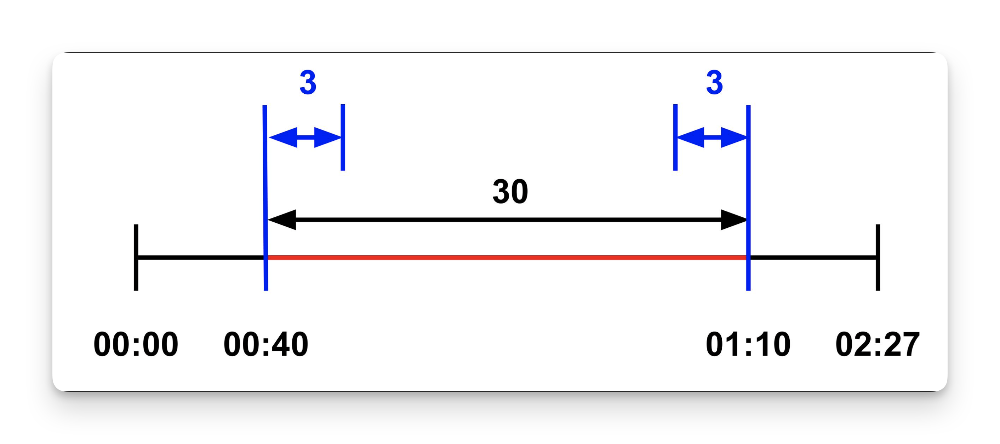
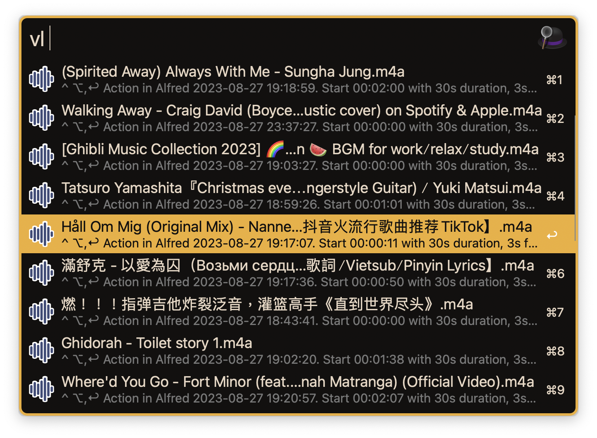
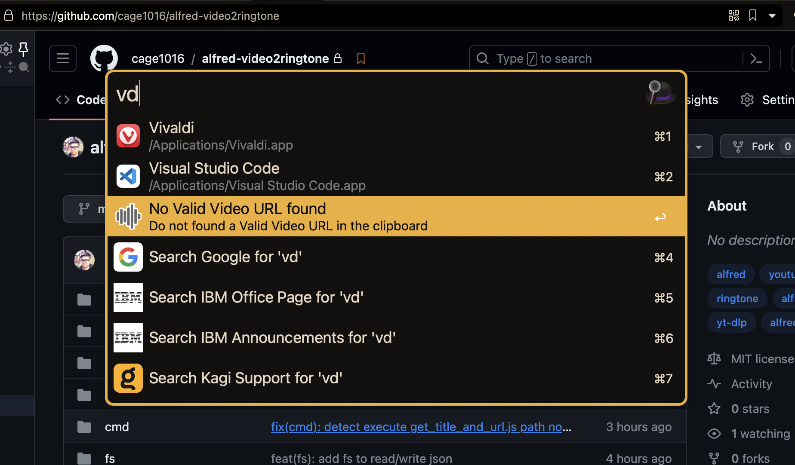
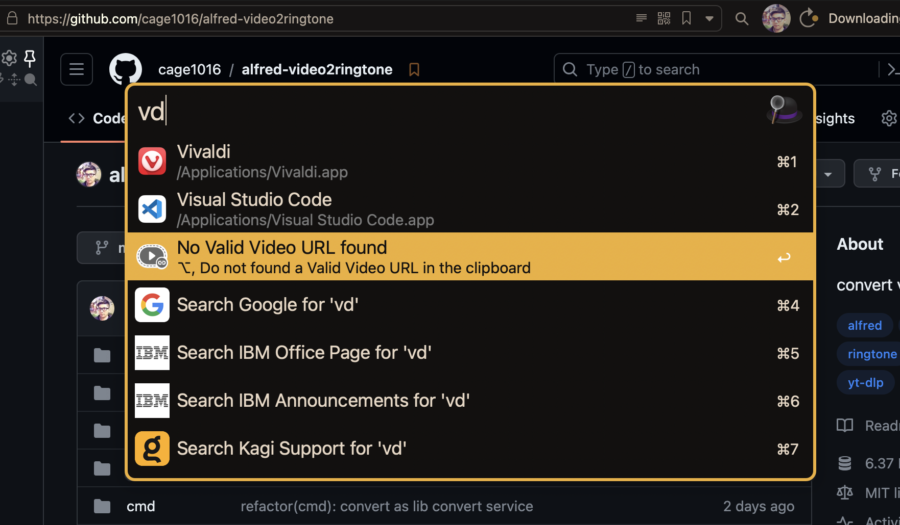
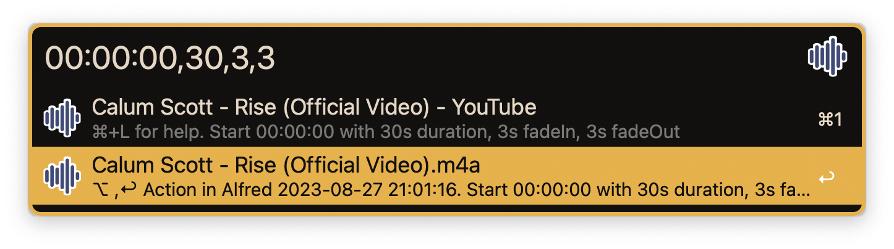
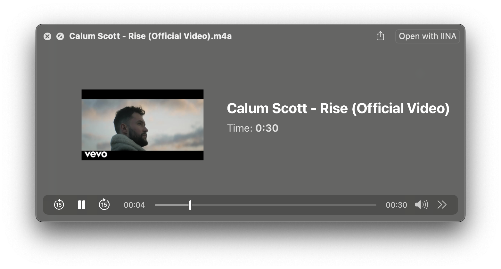
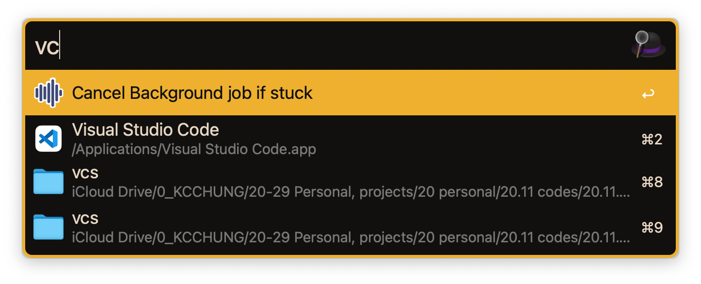

# alfred-video2ringtone

Alfred workflow to convert video to ringtone

[](https://github.com/cage1016/alfred-video2ringtone/actions/workflows/release.yml)
[](https://github.com/cage1016/alfred-video2ringtone/actions/workflows/release_auto_update.yml)
[](https://lbesson.mit-license.org/)

[](https://codecov.io/gh/cage1016/alfred-video2ringtone)


## Prerequisites

- Alfred 5
- [yt-dlp/yt-dlp: A youtube-dl fork with additional features and fixes](https://github.com/yt-dlp/yt-dlp) version 2023.07.06
- [FFmpeg/FFmpeg](https://github.com/FFmpeg/FFmpeg)

## Features

- Convert Video to `m4a` ringtone embeded cover art
- Custom ringtone duration (max 40 seconds), fade in/out duration
- Universal Action `Convert video 2 ringtone` to convert video to ringtone
- Detect video from browser and clipboard
  - Browser: Safari, Google Chrome, Chromium, Opera, Vivaldi, Brave Browser, Microsoft Edge
- Support Sites `support-site.json` is depend on [yt-dlp/yt-dlp](https://github.com/yt-dlp/yt-dlp) support sites. It's possible to add more sites by yourself. The folloiwing sites are added by default:
  - Youtube
  - Bilibili
  - nicovideo
  - soundcloud

## Installation

Visit the [Releases](https://github.com/cage1016/alfred-video2ringtone/releases) to download the latest release.

## Usage

### Ringtone concept



## List exist ringtone

- `vl` keyword to list exist ringtone
- `⇧` to preview
- `⌥+↩` to remove ringtone
- `^+↩` to re-convert ringtone again
- `↩` with `Action in Alfred`



### Detect video from browser

- `vd` keyword to detect video from browser or clipboard



- `⌥+↩` to launch `support-site.json` 



### Convert video 2 ringtone & preview

```
HH:MM:SS ex: 00:00:30
HH:MM:SS,duration ex: 00:00:30,2
HH:MM:SS,duration,FadeIn&Out  ex: 00:00:30,2,2
HH:MM:SS,duration,FadeIn,FadeOut ex: 00:00:30,3,2,2
```

#### URL
- `⌘+L` for above help
- `⇧` to preview URL page
- `⌥+↩` to Open URL page

#### Ringtone
- `⇧` to preview ringtone
- `⌥+↩` to remove ringtone
- `↩` with `Action in Alfred`





### Cancel

Due to workflow leverage `yt-dlp` and `ffmpeg` to download video and convert to `mpa` format ringtone as background process. If you want to cancel the stuck process, just type `vc` keyword.



## Third Party Libraries
- [wellmoon/m4aTag: add or modify tag for m4a file by golang](https://github.com/wellmoon/m4aTag)

## Change Log

### 0.1.0-rc.1
- Initial release

## License
This project is licensed under the MIT License. See [LICENSE](LICENSE) for details.