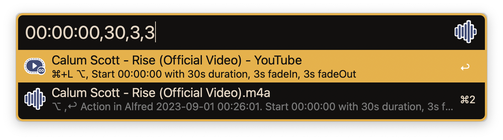
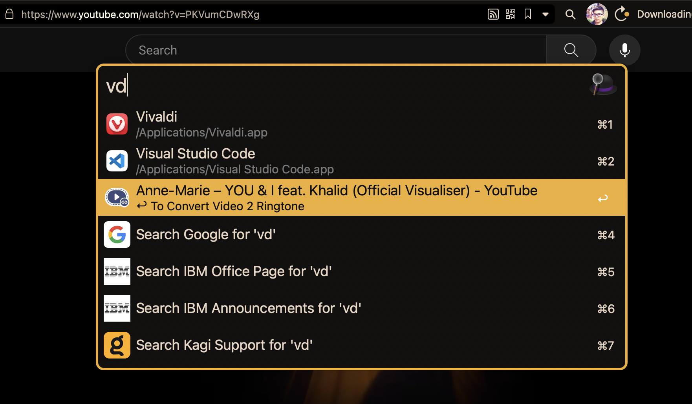

# alfred-video2ringtone

Alfred workflow to convert video to ringtone

## Prerequisites

- Alfred 5
- [yt-dlp/yt-dlp: A youtube-dl fork with additional features and fixes](https://github.com/yt-dlp/yt-dlp)

## Features

- Universal Action `Convert video 2 ringtone` to convert video to ringtone
- Detect video from browser and clipboard
  - Browser: Safari, Google Chrome, Chromium, Opera, Vivaldi, Brave Browser, Microsoft Edge
  - Support Sites: Youtube, Bilibili

## Installation

Visit the [Releases](https://github.com/cage1016/alfred-video2ringtone/releases) to download the latest release.

## Usage

### Convert video 2 ringtone & preview

## List exist ringtone

### Detect video from browser

## Change Log

### 0.1.0
- Initial release

## License
This project is licensed under the MIT License. See [LICENSE](LICENSE) for details.